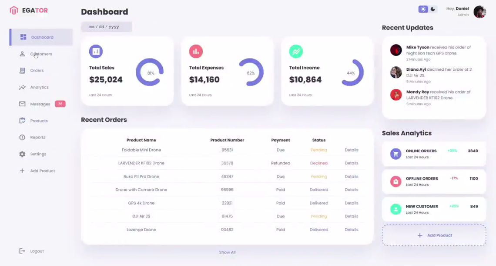

# RESPONSIVE DASHBOARD USING HTML, CSS & JAVASCRIPT

An eCommerce Site Dashboard Project
This is a group project where a team of students has come together to create a responsive dashboard for an eCommerce website. The primary goal of this project is to enhance our knowledge and skills in HTML, CSS, and JavaScript.

## Table of Contents 
  - Project Description
  - Project Features
  - Getting Started
  - Prerequisites
  - Installation

## Project Description
This project aims to develop a responsive dashboard for an eCommerce site. The dashboard will provide valuable insights, metrics, and user-friendly interfaces to help users manage and analyze data related to the eCommerce platform. Our goal is to create a visually appealing and user-friendly interface while applying best practices in web development.

## Project Features
Responsive design for various screen sizes and devices.
User authentication and authorization.
Real-time data updates and analytics.
Interactive charts and data visualizations.
Product management and inventory tracking.
Order and sales monitoring.
Customer and user account management.

## Getting Started
To get started with this project, follow the instructions below.

## Prerequisites
Before you begin, make sure you have the following software and tools installed:

--Web browser
--Code editor (e.g., Visual Studio Code)
--Git

## Installation
--Clone the repository to your local machine:
bash
Copy code
` git clone https://github.com/sharpartzgh/Responsive-Dashboard.git`
- Open the project in your code editor.

Start a local development server or use a tool like Live Server to view the project.

# Team-Members
- Xandra - Front-end Developer
- Frederick - Frontend Developer
- Wilson Siaw - Frontend Developer
- Elizabeth Mbugua - Frontend Developer
- Ann - Fontend Developer

